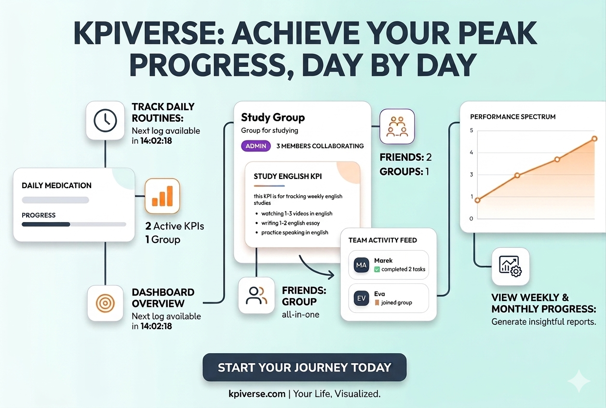

### KPIverse

A full-stack web application for tracking personal and group KPIs (Key Performance Indicators). Built with NestJS, React, and PostgreSQL.

## 📋 Overview

KPIverse allows users to:
- Create and track personal KPIs with daily, weekly, or monthly tasks
- Form groups to collaborate on shared KPIs
- Add friends and view their activity
- Visualize progress with interactive charts
- Compete on group leaderboards

## ✨ Features

### Personal KPIs
- Create KPIs with custom tasks
- Daily, weekly, or monthly tracking intervals
- Progress tracking with visual charts
- Activity history

### Group KPIs
- Create or join groups
- Collaborative KPI tracking
- Member leaderboards
- Role-based permissions (Admin/Member)
- Add member, delete member(only Admin)

### Social Features
- Search friends by name or email, sent/accept friend requests, delete friends
- Activity feed showing friend and group activities
- User profiles with statistics

### Visualizations
- Interactive line charts for progress tracking
- Member contribution charts for group KPIs
- Activity timelines

### 🛠️ Tech Stack
## Backend
- Framework: NestJS v11

- Database: PostgreSQL with Prisma ORM

- Authentication: JWT with Passport

- Validation: class-validator, class-transformer

- Security: bcrypt for password hashing

## Frontend
- Framework: React v19

- Build Tool: Vite

- Styling: Tailwind CSS v4

- Routing: React Router v7

- Charts: Chart.js with react-chartjs-2

- Icons: Lucide React

- HTTP Client: Axios

- Type Safety: TypeScript

## 🗄️ Database Schema
- Key models:

- User: User accounts and profiles

- KPI: Personal and group KPIs

- KPITask: Individual tasks within KPIs

- KPILog: Task completion logs

- Group: Group information

- GroupMember: Group membership with roles

- Friend: Friend relationships

- Activity: User activity tracking

## 👤 Author
Hoang Tiep

## 📄 License
This project is licensed under the MIT License.